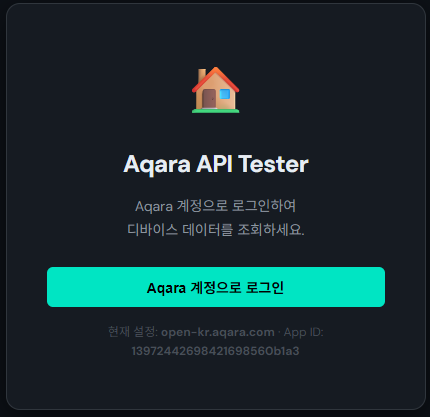
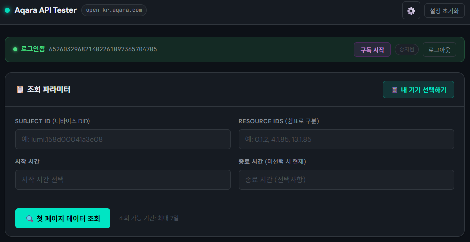
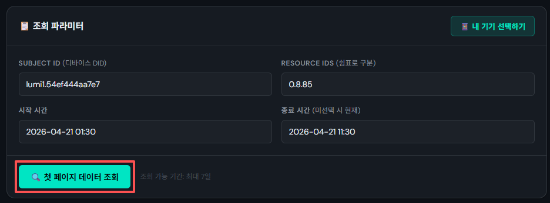
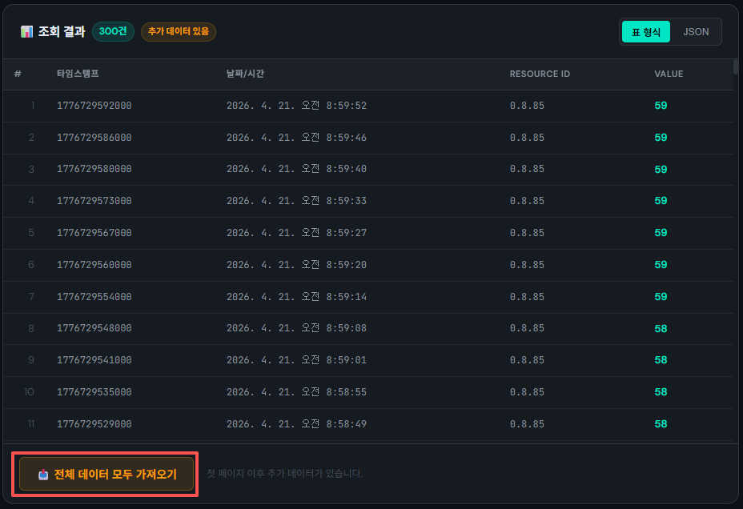
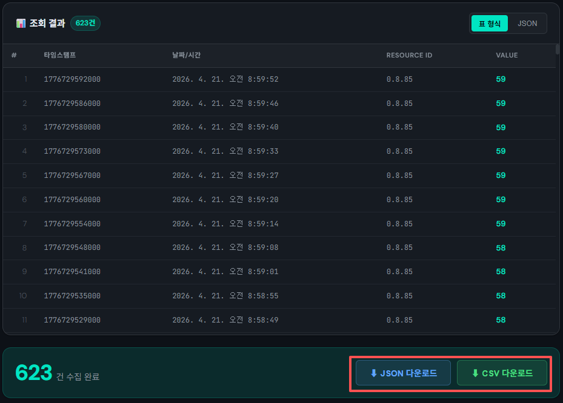

# 아카라 API 테스터 사용 가이드  

## 1. APPID 등 필수 정보 확인
aqara 개발자 사이트(https://developer.aqara.com/) 통해 APPID 등 정보를 확인

## 2. 사이트 사용법
1. 사이트 접속 후 서버 도메인을 '🇰🇷 한국 (open-kr.aqara.com)'선택한 후, aqara 개발자 사이트 통해 확인된 APPID 등 정보를 입력하고 '저장하고 시작하기' 클릭
 

2. 'Aqara 계정으로 로그인' 클릭

3. 팝업창에 Aqara 계정 정보 입력 후 로그인

3. 로그인 성공 후 Subject ID 등 정보 모두 입력 후 '첫 페이지 데이터 조회 중' 클릭

3-1. '내 기기 선택하기' 통한 정보 입력
- '내 기기 선택하기' 클릭 

- 조회할 기기 선택(하나만 선택 가능)

- 조회할 디바이스의 Resource ID 선택(여러개 선택 가능, 최대 100개)

3.2. 직접 입력 

- 디바이스DID 등 정보 직접 입력 후 '첫 페이지 데이터 조회' 클릭

4. 데이터 300건 이상일 경우 '전체 데이터 모두 가져오기' 클릭

5. 전체 데이터 조회 완료 후 데이터 다운로드 클릭

